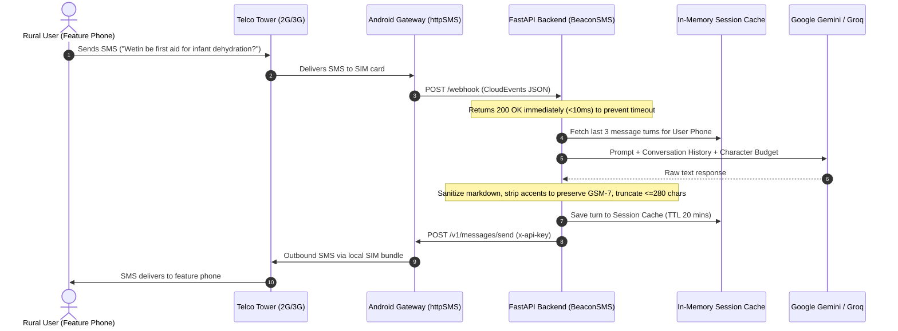

# Technical Architecture & Engineering Specifications

BeaconSMS is engineered for maximum throughput, resilient offline delivery, and zero-loss asynchronous processing over standard cellular SMS channels.

---

## 1. End-to-End System Topology

```
+-------------------+        GSM 2G/3G        +-----------------------------+
| Any Feature Phone |  <===================>  | Android SIM Gateway         |
| (itel / Nokia)    |      Cellular SMS       | (httpSMS Background Service)|
+-------------------+                         +-----------------------------+
                                                             |
                                               HTTPS Webhook | HTTPS REST API
                                                (CloudEvent) | (x-api-key)
                                                             v
                                              +-----------------------------+
                                              | FastAPI Core Backend Engine |
                                              +-----------------------------+
                                                             |
                 +-------------------------------------------+-------------------------------------------+
                 |                                           |                                           |
                 v                                           v                                           v
    +-------------------------+                 +-------------------------+                 +-------------------------+
    | Google Gemini API       |                 | Groq Ultra-Fast API     |                 | OpenAI API              |
    | (gemini-1.5-flash)      |                 | (llama-3.1-8b-instant)  |                 | (gpt-4o-mini)           |
    | ~400ms / Multilingual   |                 | ~280ms / Ultra-low      |                 | High multilingual       |
    +-------------------------+                 +-------------------------+                 +-------------------------+
```

---

## 2. Sequence Diagram



---

## 3. The SMS Encoding & Character Budgeting Challenge

In cellular telecommunications, text messages are transmitted using one of two character encodings:

### GSM 7-bit Default Alphabet (GSM-7)
* **Single SMS limit:** **160 characters**.
* **Concatenated SMS:** Multi-part messages are split into segments of **153 characters** (7 characters reserved for UDH headers).
* Standard plain English, numbers, and basic Latin punctuation fall under GSM-7.

### UCS-2 Encoding (16-bit Unicode)
* **Single SMS limit:** **70 characters** (a 56% penalty).
* **Concatenated SMS:** Split into segments of **67 characters**.
* **The Danger:** A single non-GSM character (such as an emoji, curly quote `’`, or Yoruba tone mark like `ọ` or `ẹ`) forces the entire carrier payload to switch to UCS-2. A 200-character answer would trigger **3 separate SMS messages**, draining airtime and increasing packet drop probability on spotty 2G connections.

### The BeaconSMS Solution:
In `src/services/ai_service.py`, the `sanitize_for_sms()` function:
1. Strips all Markdown elements (`**`, `*`, `#`, `` ` ``).
2. Converts Unicode diacritics into plain phonetic ASCII (`ọ` $\rightarrow$ `o`, `ẹ` $\rightarrow$ `e`, `à` $\rightarrow$ `a`).
3. Cleans whitespace and truncates at sentence boundaries to fit within 280 characters (exactly **2 GSM-7 segments**).

---

## 4. Latency Budget Analysis

When a mother or farmer is waiting on a text message, every second matters.

| Stage | Transport | Duration | Optimization |
| :--- | :--- | :--- | :--- |
| **Inbound SMS** | Feature phone $\rightarrow$ Android SIM | 2,000 – 3,500 ms | Telecom carrier baseline |
| **Webhook Delivery** | Android App $\rightarrow$ FastAPI | 300 – 600 ms | Local Wi-Fi or 4G data |
| **Webhook Ack** | FastAPI $\rightarrow$ Android App | **< 10 ms** | **Fire-and-forget background worker** |
| **AI Generation** | FastAPI $\rightarrow$ Gemini / Groq | **300 – 800 ms** | Fast Flash/Instant models |
| **Sanitization & Cache** | In-memory Python | **< 2 ms** | Regex + ASCII normalization |
| **Outbound Dispatch** | FastAPI $\rightarrow$ httpSMS API | 300 – 600 ms | Async HTTPX client |
| **Outbound SMS** | Android SIM $\rightarrow$ Feature phone | 2,000 – 3,500 ms | Telecom carrier delivery |
| **Total Roundtrip** | **End-to-End** | **~5.0 – 8.5 seconds** | Matches standard human SMS cadence |
